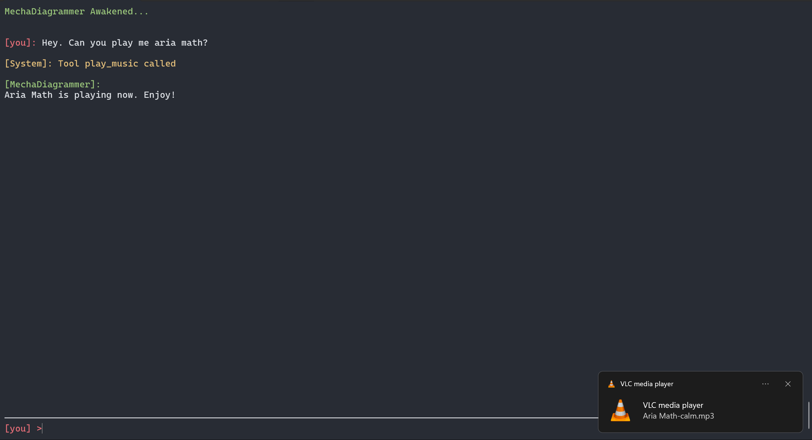
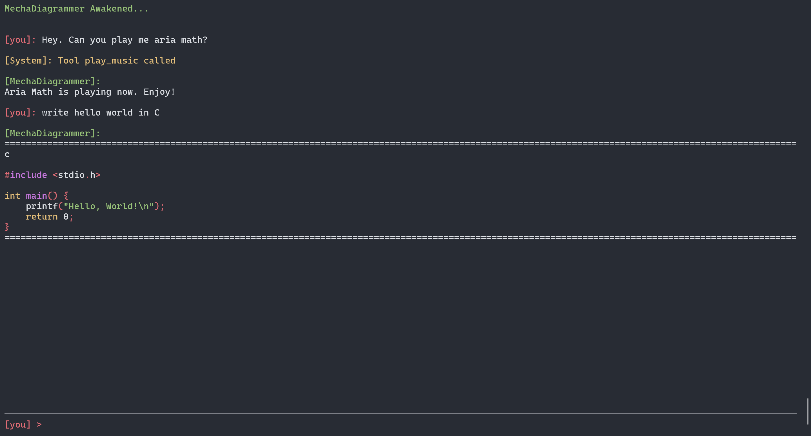

# MechaDiagrammer
A fully local AI assistant with wake-word activation, voice interaction, tool calling, terminal UI, and customizable personalities. Powered by local LLMs, Whisper speech recognition, and Kokoro TTS.




mechaDiagrammer is a local AI assistant built in Python that supports:

* Local LLM endpoints (LM Studio / OpenAI-compatible APIs)
* Voice activation + speech control
* Tool/plugin system (extensible via `tools_dir`)
* Music player and custom tool execution
* Configurable behavior through `config.json`

---

# Getting Started

## 1. Clone the repository

```bash
git clone https://github.com/hsadr579/MechaDiagrammer.git
cd mechaDiagrammer
```

---

## 2. Create a virtual environment (recommended)

### Windows

```bash
python -m venv venv
venv\Scripts\activate
```

### macOS / Linux

```bash
python3 -m venv venv
source venv/bin/activate
```

---

## 3. Install dependencies

```bash
pip install -r requirements.txt
```

## Optional: PyTorch with CUDA Support

If you have an NVIDIA GPU, you can install PyTorch with CUDA support for faster performance:

```bash
pip install torch torchvision torchaudio --index-url https://download.pytorch.org/whl/cu124
```

For CPU-only systems:

```bash
pip install torch torchvision torchaudio
```


---

# Configuration

The project is configured via `config.json`.

## Example config.json

```json
{
    "base_url": "http://localhost:1234/v1",
    "api_key": "lm-studio",
    "model": "Gemma-4-E4B-Uncensored-HauhauCS-Aggressive-IQ4_NL",
    "temperature": 0.3,
    "ai_name": "MechaDiagrammer",
    "user_name": "User",
    "user_sysprompt": "you should not introduce yourself unless I ask you to.",
    "voice_summoning_word": "MechaDiagrammer",
    "voice_stopping_word": "sleep now",
    "voice_summoning_answers": [
        "At your service",
        "MechaDiagrammer Listening"
    ],
    "voice_max_silence_gap": 0.45,
    "voice_max_seg_length": 10,
    "voice_listen_during_speak": true,
    "TTS_voice": "christopher",
    "music_player": {
        "music_path": "Path to music folder",
        "prefixes": [
            "mp3",
            "ogg",
            "mp4",
            "wav"
        ]
    }
}
```
> **Important note about musics**
>
> The filename of musics that are stored inside `music_path` must be something like this: `music_name-music_mood.format`
---

## Config Fields Explained

### AI Settings

* `base_url` → Local or remote OpenAI-compatible API endpoint
* `api_key` → API key (LM Studio can use placeholder like `"lm-studio"`)
* `model` → Model name loaded by your backend
* `temperature` → Controls randomness (0 = deterministic, 1 = creative)

---

### Identity Settings

* `ai_name` → Name of your assistant
* `user_name` → Name used for the human user
* `user_sysprompt` → System-level behavior instruction

---

### Voice Control

* `voice_summoning_word` → Wake word (e.g. "MechaDiagrammer")
* `voice_stopping_word` → Stop listening command
* `voice_summoning_answers` → Random responses when activated
* `voice_max_silence_gap` → Max silence before stopping input (seconds)
* `voice_max_seg_length` → Max audio segment length (seconds)
* `voice_listen_during_speak` → Whether it listens while speaking
* `TTS_voice` → Voice model used for speech synthesis

>You can add more voices from `voices/kokoro_voices_list.txt` to `kokoro_voices.json` with a determined name and personality(see both files for inspiration).

---

### Music Player Settings

* `music_path` → Folder containing music files
* `prefixes` → Allowed audio file formats

---
## Code Colorizer (languages.json)

mechaDiagrammer includes a built-in syntax colorizer that highlights code based on rules defined in `languages.json`.

This system is lightweight and fully configurable — you can add or modify languages easily without changing the core code.

---

## File location

```
languages.json
```

---

## Example format

```json
{
    "c": {
        "comment": "//",
        "mult_comment": [
            "/*",
            "*/"
        ],
        "string": [
            "\""
        ],
        "keywords": [
            "auto",
            "break",
            "case",
            "char",
            "const",
            "continue",
            "default",
            "do",
            "double",
            "else",
            "enum",
            "extern",
            "float",
            "for",
            "goto",
            "if",
            "inline",
            "int",
            "long",
            "register",
            "return",
            "short",
            "signed",
            "sizeof",
            "static",
            "struct",
            "switch",
            "typedef",
            "union",
            "unsigned",
            "void",
            "volatile",
            "while"
        ],
        "compiler_key": [
            "define",
            "include",
            "main",
            "ifdef",
            "ifndef",
            "endif"
        ],
        "special_char": "\\"
    }
}
```

---

## Field explanation

### `comment`

Single-line comment prefix:

```c
// comment
```

---

### `mult_comment`

Multi-line comment delimiters:

```c
/* comment block */
```

Format:

```json
["start", "end"]
```

---

### `string`

String delimiters:

```c
"text"
'text'
```

---

### `keywords`

Language keywords highlighted by the colorizer:

```c
int, return, if, for
```

---

### `compiler_key`

Preprocessor or compiler-related tokens:

```c
#include
#define
#ifdef
```

---

### `special_char`

Escape character used in parsing strings:

```json
"\\"
```

---

## How it works

* The colorizer reads `languages.json` at runtime
* Detects language based on file/type tag
* Applies rules for:

  * keywords
  * strings
  * comments
  * compiler directives
* Outputs colored console/UI text

---

## Adding a new language

Just add another entry:

```json
"python": {
    "comment": "#",
    "mult_comment": ["\"\"\"", "\"\"\""],
    "string": ["\"", "'"],
    "keywords": ["def", "class", "import", "return"],
    "compiler_key": [],
    "special_char": "\\"
}
```

---

## Notes

* This system is rule-based (not AST-based)
* Fast and lightweight
* Fully user-editable
* No external libraries required

---

# Tool System (Plugins)

mechaDiagrammer supports a modular tool system.

## Structure

All tools go inside:

```
tools_dir/
    music_player/
        main.py
    your_tool/
        main.py
```

Each tool must contain a `main.py` file with a structure like:

---

## Tool Template Example

```python
def init():
    # initialization logic
    pass

def kill():
    # cleanup logic
    pass


def your_function(args):
    return {
        "tool_name": "your_tool",
        "result": "something happened",
        "instruction": "report result in plain text"
    }


def add_tool(tool_dict):
    tool_dict.setdefault("your_tool", {
        "function": your_function,
        "description": "Describe what your tool does.",
        "parameters": {
            "type": "object",
            "properties": {
                "example_param": {
                    "type": "string",
                    "description": "example input"
                }
            },
            "required": []
        }
    })
```

---

## How Tool Loading Works

* The system scans `tools_dir/`
* Each folder is treated as a tool package
* `add_tool(tool_dict)` registers tools into the main agent
* Tools return structured JSON responses
* The AI decides when to call tools automatically

---

## Example: music_player Tool

Existing `music_player` tool:

* Scans local folder for music files
* Supports:

  * play by name
  * play by mood
  * list music
* Dynamically builds metadata from filenames

---

# Running the Project

```bash
python main.py
```

---

## Internal Commands

mechaDiagrammer supports built-in console commands for controlling runtime behavior.
All commands start with a backslash `\`.

### Usage format

```bash
\command [args]
```

---

## ⚙️ Available Commands

### Exit program

```bash
\exit
```

Stops the application immediately.

---

### Microphone control

Turn voice detection OFF:

```bash
\mic_off
```

Turn voice detection ON:

```bash
\mic_on
```

---

### Voice output control

Disable AI voice responses:

```bash
\voice_off
```

Enable AI voice responses:

```bash
\voice_on
```

---

### Conversation history

Show full conversation history:

```bash
\hist
```

Clear conversation history:

```bash
\clear_hist
```

Disable history tracking:

```bash
\hist_off
```

Enable history tracking:

```bash
\hist_on
```

---

## Notes

* Commands are processed only if input starts with `\`
* History is **disabled by default**
* When history is disabled, the assistant will not store previous messages
* System commands do not get sent to the AI model

---

# Notes

* This project is designed for **local LLM usage (LM Studio / Ollama-style APIs)**
* Works best with OpenAI-compatible endpoints
* Tools are fully extendable without modifying core logic
* Voice features depend on system audio configuration

---

# Extending the Project

To add a new capability:

1. Create a folder inside `tools_dir`
2. Add `main.py`
3. Implement `add_tool(tool_dict)`
4. Restart the assistant

